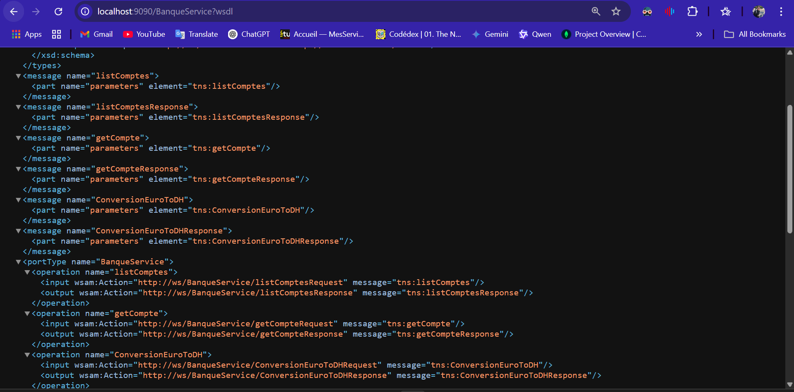
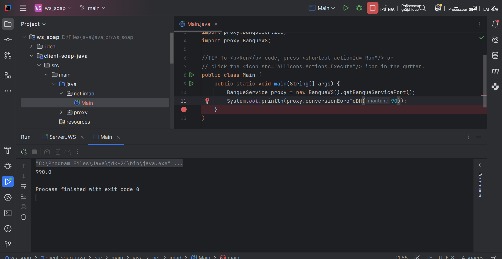
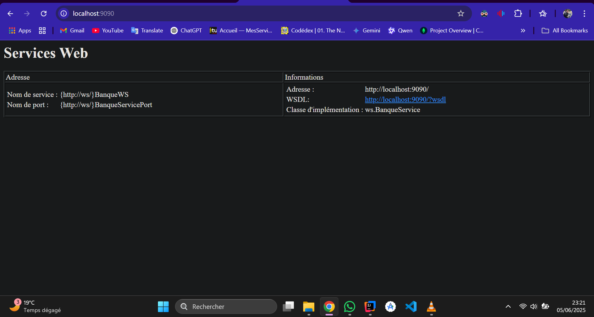
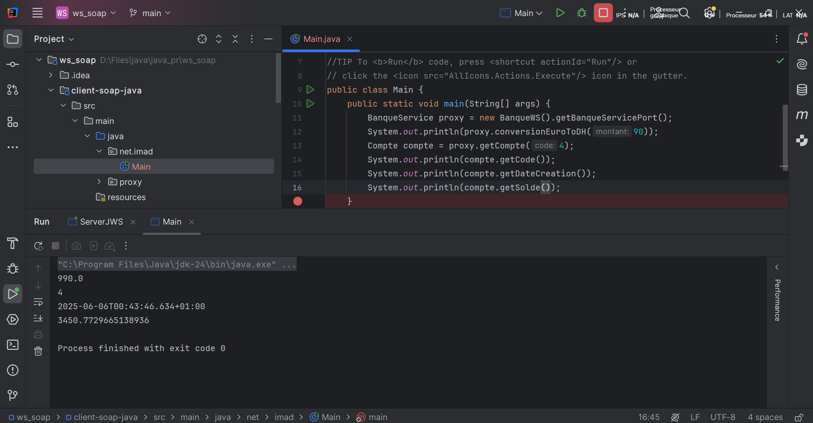

#  Web Services SOAP avec WSDL en Java

>  Projet complet pour comprendre, développer et consommer un service web SOAP basé sur JAX-WS avec génération de WSDL et client SOAP Java.

---

##  Informations de l’auteur

- ** Nom complet:** OUCHTOUBANE ANASS  

---

## Objectif du projet

Ce projet met en œuvre un service web **SOAP** permettant :

- La **conversion de montants en Euro vers Dirham (MAD)**
- La **consultation d’un compte bancaire**
- L’affichage de **tous les comptes**  
- Le tout exposé à travers un **WSDL généré dynamiquement** par JAX-WS.

---

## Concepts abordés

|  Concept |  Description |
|-----------|----------------|
| **SOAP** | Protocole basé sur XML pour les échanges de données entre applications |
| **WSDL** | Langage de description d’interface du Web Service |
| **JAX-WS** | API Java pour créer et publier des Web Services SOAP |
| **JAXB** | API de liaison Java ↔ XML (marshalling/unmarshalling) |
| **Stub** | Code client auto-généré pour accéder au Web Service |
| **Skeleton** | Code serveur auto-généré pour traiter les requêtes SOAP |
| **OXM** | Object-XML Mapping, utilisé avec JAXB |
| **Middleware** | Logiciel intermédiaire (ici, le serveur SOAP) qui relie client et service |

---

## Annotations JAXB principales

| Annotation | Utilité |
|------------|---------|
| `@XmlRootElement` | Indique l’élément racine XML |
| `@XmlElement` | Convertit un champ en élément XML |
| `@XmlAttribute` | Convertit un champ en attribut XML |
| `@XmlTransient` | Ignore le champ dans l’export XML |
| `@XmlAccessorType` | Définit comment JAXB accède aux propriétés |
| `@XmlSchema` | Associe un namespace à un package |

---

##  Technologies utilisées

- Java 17
- Maven
- JAX-WS (SOAP)
- JAXB
- IntelliJ IDEA
- SoapUI
- Git & GitHub

---

## Structure du projet

```
📦 ws_soap
 ┣ 📂 client-soap-java
 ┃ ┗ 📄 Main.java
 ┣ 📂 src/main/java/ws
 ┃ ┣ 📄 Compte.java
 ┃ ┣ 📄 BanqueService.java
 ┃ ┗ 📄 ServerJWS.java
 ┣ 📂 Screene
 ┃ ┗ 📸 Captures d’écran
 ┣ 📄 README.md
 ┗ 📄 pom.xml
```

---

##  Fonctionnalités du service

- `conversionEuroToDH(montant: double) : double`  
- `getCompte(code: int) : Compte`  
- `listComptes() : List<Compte>`  

---

##  Déploiement du Web Service

```java
Endpoint.publish("http://0.0.0.0:9090/", new BanqueService());
```

📎 Naviguez ensuite vers :  
[http://localhost:9090/BanqueService?wsdl](http://localhost:9090/BanqueService?wsdl)

---

##  Exemple de WSDL généré

Le WSDL contient :
- Les types (`Compte`)
- Les messages (`getCompte`, `conversionEuroToDH`)
- Les opérations
- Le `binding` et l’`endpoint`

---

##  Génération du stub avec `wsimport`

```bash
wsimport -keep -p proxy http://localhost:9090/BanqueService?wsdl
```

 Les classes générées (stub) permettent au **client SOAP Java** d’appeler facilement le web service.

---

## Exemple de client Java (Main.java)

```java
BanqueService proxy = new BanqueWS().getBanqueServicePort();
System.out.println(proxy.conversionEuroToDH(90));
```

---

## 7. Captures d’écran

| Capture | Description |
|--------|-------------|
|  | Résultat de `getCompte` dans SoapUI |
|  | Liste des comptes SOAP |
|  | Aperçu du fichier WSDL |
|  | Code du stub (proxy généré) |
|  | Page de test des services |
|  | Test `convertEuroToDH` via SoapUI |
|  | Appel client Java au web service |

---

##  Résultat attendu dans la console

```
Méthode conversion EuroToDH : 990.0
*************** Consulter un compte ***************
1
6540.23
2025-06-06
*************** Liste des comptes ***************
Code : 1 | Solde : 4550.0 | Date : 2025-06-06
...
```

---

##  Résumé

Ce projet illustre toutes les étapes essentielles de création, déploiement, test et consommation d’un Web Service SOAP :
- Construction avec **JAX-WS**
- Sérialisation via **JAXB**
- Génération de **WSDL**
- Tests avec **SoapUI**
- Génération et usage d’un **client proxy Java**
- Mise en ligne du projet sur **GitHub**

---

## 7- Captures d’écran


###  Visualisation du fichier `WSDL`


###  Code Proxy (STUB généré à partir du WSDL)


### ️ Interface Web de test des services SOAP



###  Exécution du client Java SOAP (appel via Proxy)



